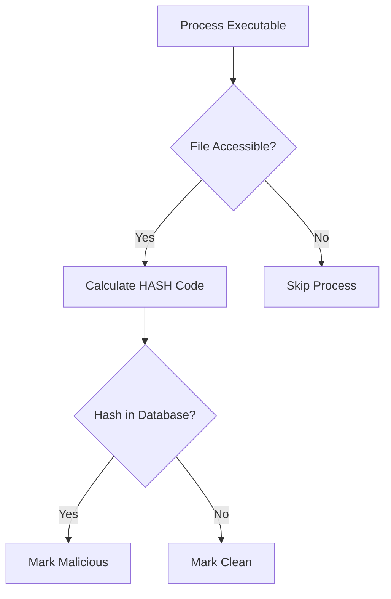
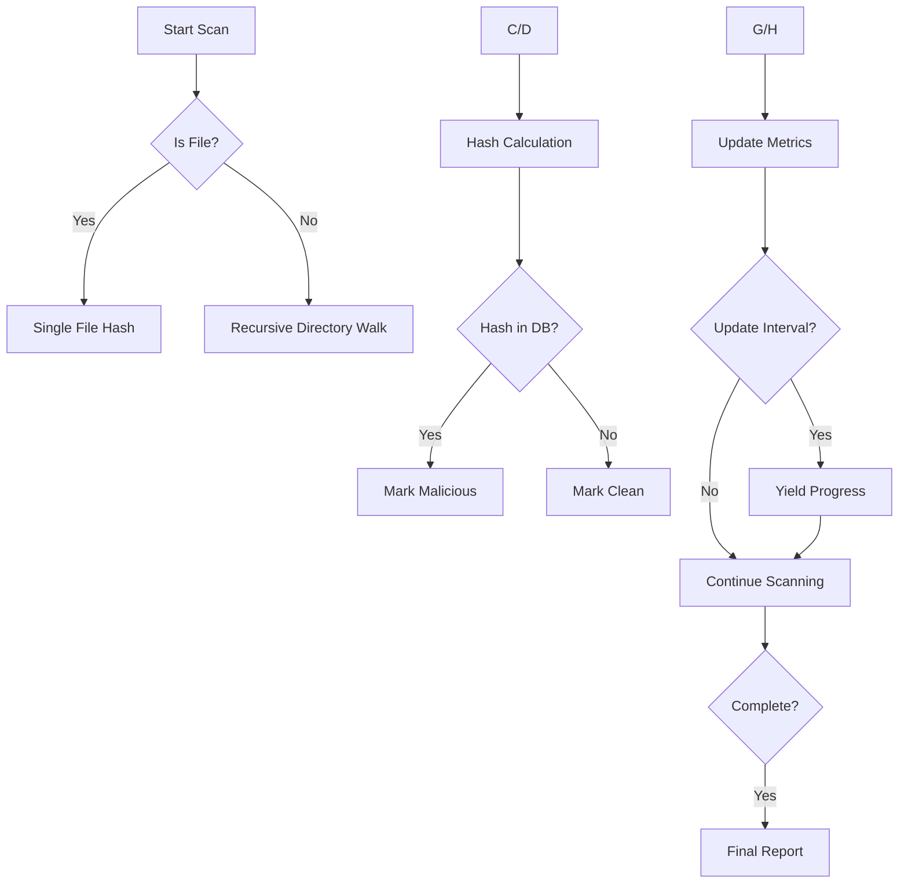
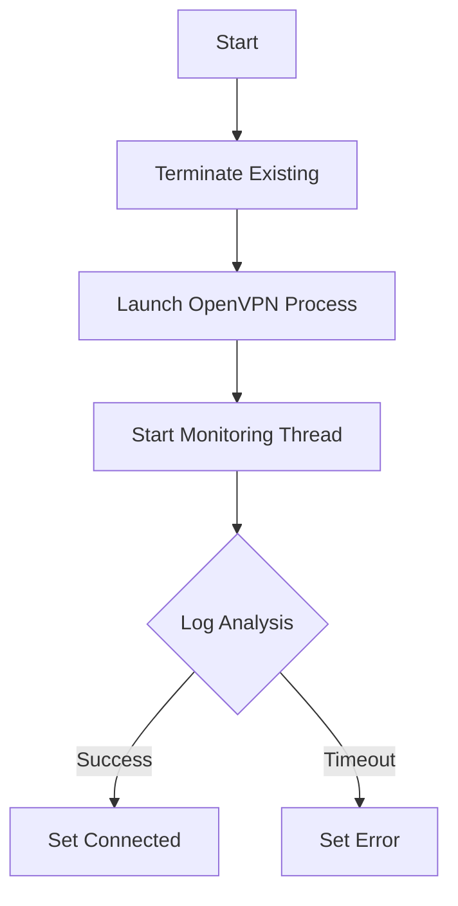

# Advanced Protection Suite

A comprehensive security application providing real-time system monitoring, malware scanning, file encryption, firewall management, and VPN integration.

## Features

- **Memory Scanner**: 
  - Scans active processes for known malicious hashes
  - Real-time scanning with progress updates via SSE

- **File Scanner**:
  - Full system/custom path scanning
  - Malware detection using hash database
  - Queue-based scanning with start/stop control

- **Task Manager**:
  - Real-time system monitoring (CPU, disk I/O)
  - Process list with resource usage
  - Server-Sent Events (SSE) for live updates

- **File Locker**:
  - AES file encryption/decryption
  - Password-protected files
  - Bulk operations and database cleanup

- **Firewall Manager**:
  - IP/Port blocking
  - Rule management (create/remove)
  - Active rule monitoring

- **VPN Client**:
  - OpenVPN profile management
  - Connection status monitoring

---

## Task Manager Module

Real-time system resource monitoring component for process and performance tracking.

### Features

- **Real-time Process Monitoring**
  - CPU percentage per process
  - Disk I/O rates (read/write)
  - Process prioritization by resource usage

- **Power Consumption Analysis**
  - CPU-based power categorization
  - 5-tier classification system
  - Process-level energy impact estimation

- **System-wide Metrics**
  - Total CPU utilization
  - Aggregate disk throughput
  - Historical data tracking (last 60 seconds)

### Key Functions

#### `update_process_info()`
Main monitoring function that:
1. Calculates disk I/O rates (MB/s)
2. Measures CPU utilization across all cores
3. Tracks per-process resource consumption
4. Maintains historical data for trend analysis

---

## Memory Scanner Module

Malware detection component that scans running processes' executables against known malicious hashes.

### Features

- **Process Memory Scanning**
  - Real-time executable hash verification
  - Malicious/Clean status classification
  - Process metadata collection (PID, name, path)
  
- **Hash Database Integration**
  - SQLite database connection
  - MD5 hash verification
  - Set-based hash lookup for O(1) complexity

- **Error Handling**
  - Process access exceptions handling
  - File I/O error protection
  - Database connection safeguards

### Key Functions

#### `connect_to_database(db_path)`
- Establishes SQLite connection
- **Parameters:**
  - `db_path`: Path to SQLite database file
- **Returns:** Connection object or None

#### `get_known_hashes(conn)`
- Retrieves malicious hashes
- **Parameters:**
  - `conn`: Active database connection
- **Returns:** Set of MD5 hashes

#### `get_file_hash(file_path)`
- Generates file MD5 checksum
- **Parameters:**
  - `file_path`: Path to executable
- **Returns:** Hexadecimal hash string or None

#### `scan_processes(known_hashes)`
- Main scanning generator function
- **Parameters:**
  - `known_hashes`: Set of malicious hashes
- **Yields:** Tuple containing:
  - Total scanned count
  - Malicious count
  - Clean count
  - Process metadata dict
 
### Workflow

---

## File Scanner Module

Malware detection component that scans filesystem entries against known malicious hashes with progress tracking.

### Features

- **Multi-mode Scanning**
  - Single file verification
  - Recursive directory scanning
  - Custom path handling

- **Performance Optimizations**
  - Progressive result yielding
  - Files/second speed calculation
  - Adaptive progress updates (0.5s or 100 files)

- **Comprehensive Reporting**
  - Malicious file cataloging
  - Skip count tracking (permission issues)
  - Real-time statistics dashboard

### Key Functions

#### `scan_path(path, known_hashes)`
Core scanning generator that:
- Handles both files and directories
- Implements adaptive progress reporting
- Maintains scan statistics
- Yields updates containing:
  - Scan status
  - Count metrics
  - Malicious file list
  - Performance data
- Thread-safe MD5 hashing
- 4KB block reading for large files
- Error-resistant file handling

### Workflow

---

## Firewall Management Module

Windows firewall management component with direct registry access and PowerShell integration.

### Features

- **Rule Management**
  - IP address blocking (IPv4/IPv6)
  - Port/protocol blocking (TCP/UDP)
  - Rule deletion by display name
  - Direction control (Inbound/Outbound)

- **Advanced Monitoring**
  - Direct Windows Registry parsing
  - Profile detection (Domain/Private/Public)
  - Active rule type identification
  - Protocol translation (6=TCP, 17=UDP)

- **PowerShell Integration**
  - Safe command execution
  - Error capturing
  - Asynchronous rule application

### Key Functions

#### `get_firewall_rules()`
Registry-based rule parser that:
- Accesses `HKEY_LOCAL_MACHINE\SYSTEM\...\FirewallRules`
- Decodes complex rule structures
- Identifies IP/Port-based rules

Returns tuple:
1. Rules list with columns: `[DisplayName, Direction, Action, Enabled, Profile]`
2. Table headers
3. Active rules dictionary with metadata

---

## File Locker Module

Secure file encryption/decryption system with database-backed management and cryptographic best practices.

### Features

- **Military-Grade Encryption**
  - AES-256-CBC via Fernet
  - PBKDF2HMAC key derivation (100k iterations)
  - Per-file cryptographic salts
  - Secure salt storage (first 16 bytes of file)

- **Database Management**
  - Automatic directory synchronization
  - File metadata tracking:
    - Original filename
    - File extension
    - Encryption status
    - File size
    - Creation timestamp
  - Orphaned entry cleanup

- **Operations**
  - Single-file encrypt/decrypt
  - Bulk re-encryption
  - Database integrity checks
  - Manual file reconciliation

---

## VPN Management Module

|  |  |
|:-----------------------------:|:----------------------------:|
| VPN Client                   | Proof                        |

OpenVPN connection manager with automated status monitoring and process management.

### Features

- **Connection Management**
  - Profile-based VPN connections
  - Background process monitoring
  - Multi-threaded status updates
  - Forceful process cleanup

- **Advanced Monitoring**
  - Log file analysis for connection verification
  - Real-time status tracking (Connecting/Connected/Disconnected)
  - Active connection persistence

- **Windows Integration**
  - Native OpenVPN binary support
  - Process tree termination
  - System service interaction

### Key Functions

#### `connect(profile)`

#### `disconnect()`
- Graceful process termination
- Force kill remaining OpenVPN processes
- Thread cleanup
- State reset

#### `get_status()`
- Returns real-time connection state:
  - Connected
  - Connecting
  - Disconnected
  - Error
